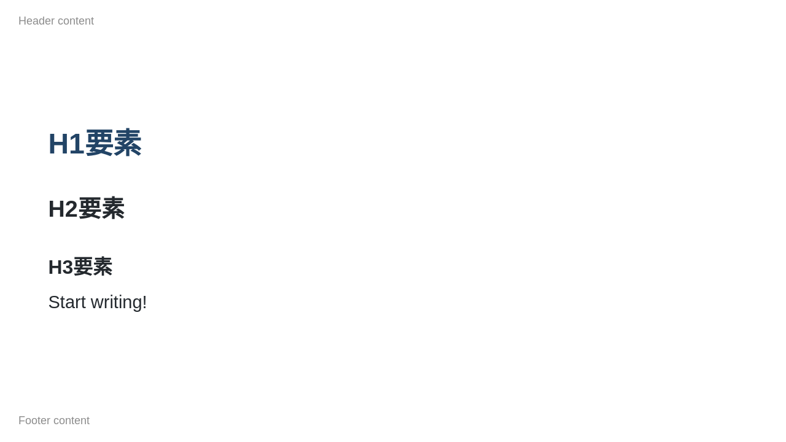
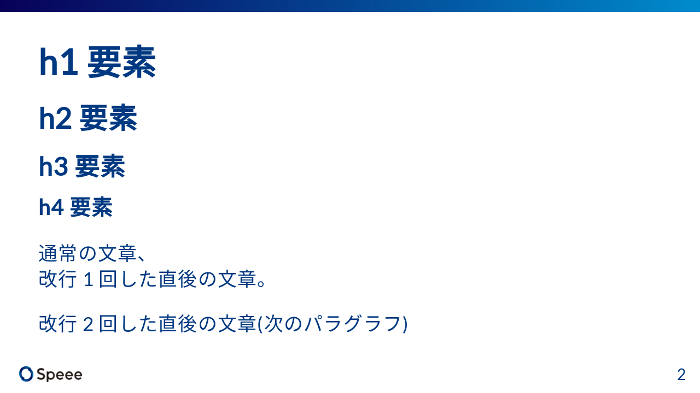
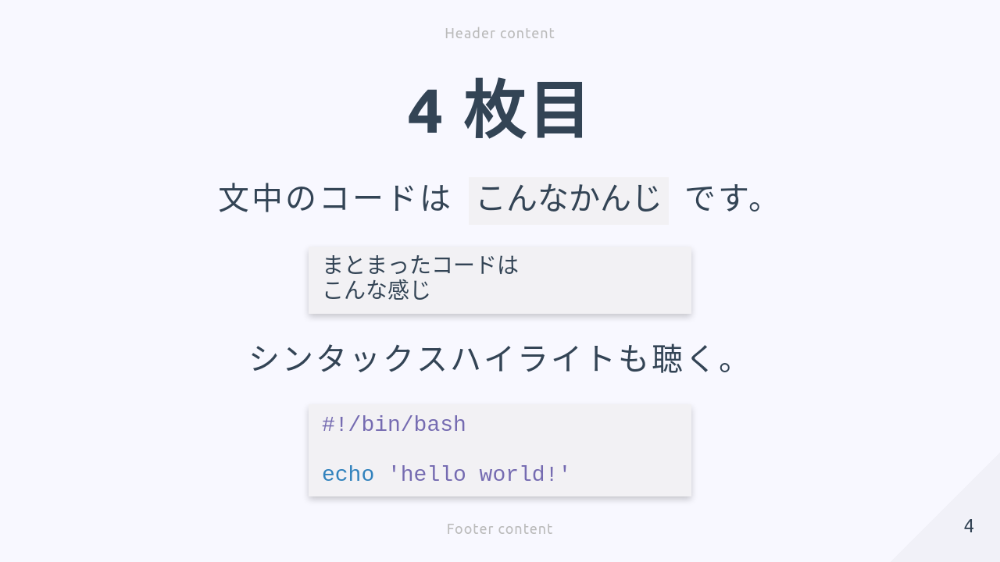

# marp-speee-theme

Speee 用の marp テーマ

# 使用例

 | 
:-------------------------:|:-------------------------:
 | 

# 使い方

## (主に Speee 社員が)株式会社 Speee の企業活動の一部として資料を作成する場合

TBW

## その他の場合

株式会社 Speee の企業ロゴを削除してください。
その他については上記と同様です。

# 開発方法

## 依存物

1. `make init` で必要なパッケージをインストールする
1. 必要に応じて theme が要求するフォントをインストールする(でないと github actions workflow 側と描画結果が一致せず、CI テストがエラーになる)

## 開発手順

1. vscode で marp 拡張をインストール
1. `make csswatch` で scss が変更されたらすぐ反映されるようにする
1. `example/example.md` を開き、vscode でプレビューしながらマークダウンファイルと SCSS を編集する

## 設計ノート

コントリビュートしてもらうときは以下を一読した上で機能追加・修正方向を考えてもらうと助かります 💦

### フォントは基本的に[Google Font](https://fonts.google.com/)を使用する

フォント指定でたくさん指定してfallbackを設定するのはウェブサイトでは有効だけど、marpでは人によってフォントが違う原因になり厄介になりやすい。
またテストでの画像比較も問題が起きやすくなる。
ウェブフォントの重いというデメリットもmarpの場合は気にならないので、ポータビリティに全振りして基本ウェブフォントとする。

### このリポジトリはCICDやgitのpre hookによるコントリビュートホスピタリティに全振りしている

だからかなりコントリビュートしやすくなっているはず。なるべくそこは維持していきたい。

# 関連ドキュメント(社内向け)

- [Speee*VI*レギュレーション.pdf (コーポレートカラー仕様)](https://drive.google.com/file/d/1m5VzUtWX6JbortXmylHLABrN_RxamyXx/view?usp=sharing)
- [【テンプレ配布】パワポ職人が本気で G スライドのマスタを作ったから見てくれ \| speee Kibela](https://speee.kibe.la/@masayuki_nagayama/22064)

# ライセンスについて

本リポジトリに含まれるリソースは Speee 企業ロゴを除いて[ライセンス](./LICENSE)に属します。
ただし Speee 企業ロゴのみは株式会社 Speee が独占的な権利を保持するため、
Speee 社員が株式会社 Speee の企業活動の一部として資料を作成する場合以外でロゴを使用したい場合は弊社までお問い合わせください。
